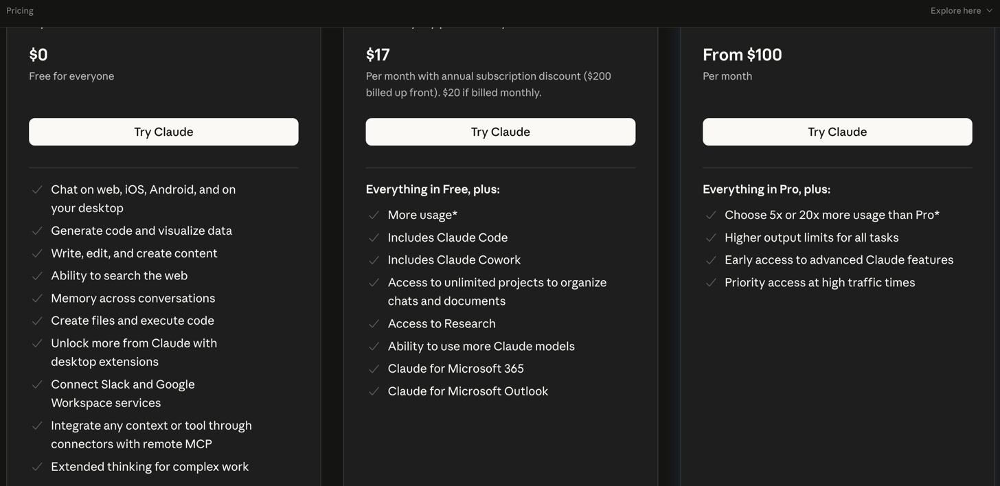
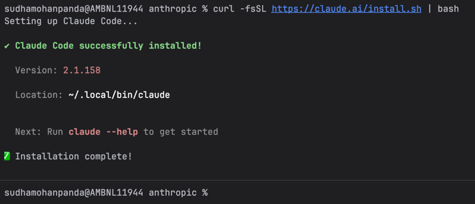
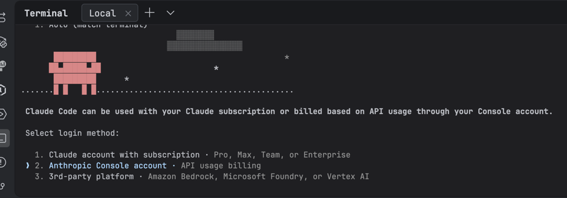
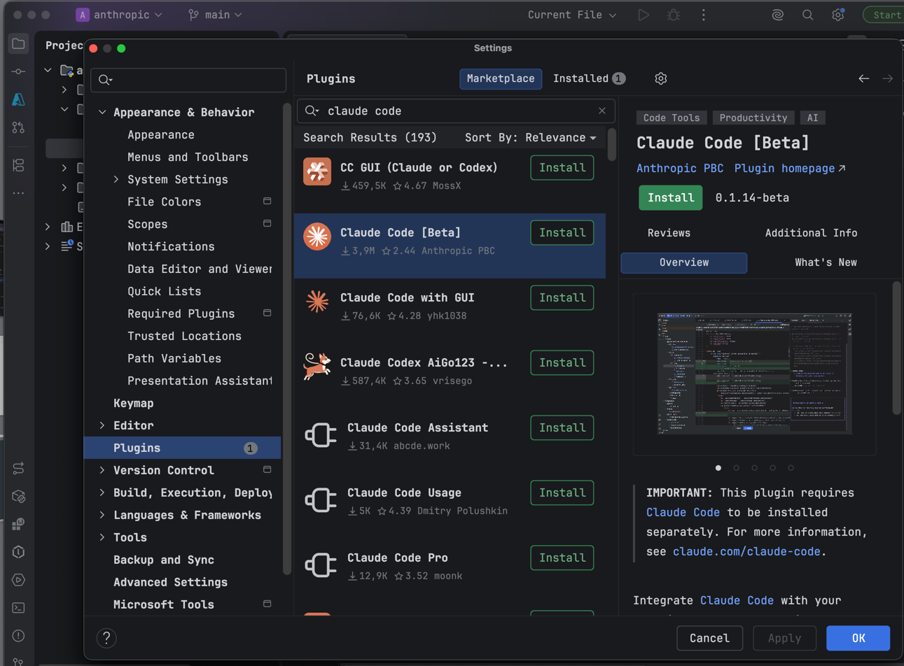

# What is Claude Code?
Claude Code is an agentic coding tool that reads your codebase, edits files, runs commands, and integrates with your development tools. Available in your terminal, IDE, desktop app, and browser.

Claude Code is an AI-powered coding assistant that helps you build features, fix bugs, and automate development tasks. It understands your entire codebase and can work across multiple files and tools to get things done.

# Step 1: Install Claude Code
curl -fsSL https://claude.ai/install.sh | bash

# Step 2: Log in to your account
claude

Claude Code is not available on the Free plan. The free tier gives you access to Claude chat on web, iOS, Android, and desktop, but the terminal-based Claude Code environment requires at least a Pro subscription or API credits. SSD Nodes
Your options:

Pro Plan — $20/month (most common choice)
You get terminal-based Claude Code with Sonnet as the default model, approximately five times the usage limits of the Free plan, extended thinking capabilities, and the ability to create unlimited projects. laozhang
Pay-as-you-go via Anthropic API (good for occasional use)
Create an account at platform.claude.com, use the ~$5 free credits to run a few sessions, then purchase additional credits only as needed. API billing only beats Pro if you're below roughly 50 sessions per month. Verdent AI
⚠️ One thing to watch out for if you go the API route: if ANTHROPIC_API_KEY is set in your shell, Claude Code bills at API rates, ignoring your subscription entirely
# How to use in IntelliJ IDEA

Claude Code must be installed to use in Intellij IDEA.

