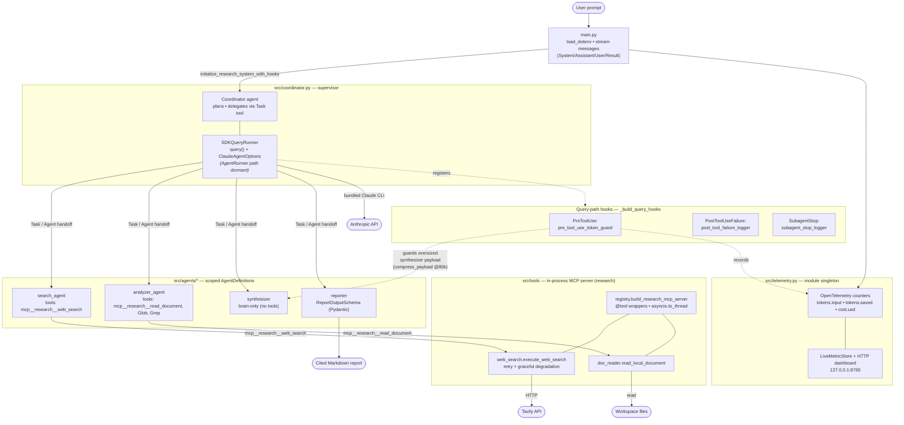

# CLAUDE.md

This file provides guidance to Claude Code (claude.ai/code) when working with code in this repository.

## What this is

A multi-agent research system built on the **Claude Agent SDK**. A Coordinator (supervisor) agent dynamically delegates to four specialized subagents — web search, document analysis, synthesis, and report generation — to research a topic and produce a cited Markdown report. The design follows a Router/Orchestrator pattern; subagent orchestration, memory, and tool execution are delegated to the SDK rather than a manual message loop (this is why LangGraph/CrewAI were not used — see `architect.md`).

## Commands

```bash
# Install dependencies (uses .venv)
python3 -m pip install -r requirements.txt

# Run the full coordinator (streams events; dashboard on by default at http://127.0.0.1:8765)
python3 main.py

# Disable the dashboard
RESEARCH_ENABLE_LOCAL_DASHBOARD=0 python3 main.py

# Payload stress test: generate a 100k-word payload, fire the compression hook, keep the dashboard live
python3 scripts/generate_dummy_research_data.py --words 100000 --hold-open

# Run tests
python3 -m unittest discover tests
python3 -m unittest tests.test_search_failure   # single test module
```

### Required environment

`.env` is auto-loaded at startup by a tiny zero-dependency `load_dotenv()` in `main.py` (existing env vars win). Keys placed only in `.env` reach the tools through this — they are **not** otherwise exported.

- `ANTHROPIC_API_KEY` — auth for the bundled Claude CLI (the SDK may also use its own logged-in credentials). `TAVILY_API_KEY` — read by `execute_web_search`; web search degrades gracefully to an error string if missing.
- `RESEARCH_MODEL` — model id override. **Default `claude-3-5-sonnet-latest` is not accessible via the bundled CLI** — run with a current id, e.g. `RESEARCH_MODEL=claude-sonnet-4-6 python3 main.py`.
- `RESEARCH_PERMISSION_MODE` — query-path permission mode (default `bypassPermissions` for unattended runs; set `default` to require explicit allow decisions against the tool allowlist).
- `RESEARCH_ENABLE_LOCAL_DASHBOARD` — `0`/`false`/`no` disables the telemetry dashboard.
- `RESEARCH_INPUT_COST_PER_MILLION` / `RESEARCH_OUTPUT_COST_PER_MILLION` — pricing overrides for the estimated-cost metric (defaults `3.0` / `15.0`).

## Architecture

> Rendered PNG of the diagram below: [`images/mermaidArchitecture.png`](images/mermaidArchitecture.png).



The runtime wiring is `main.py` → `src/coordinator.py`; everything else hangs off the coordinator.

- **`src/coordinator.py`** — the heart of the system. It builds the supervisor and is **defensive about the installed SDK's API surface**, choosing one of two runners:
  - **`query()` + `ClaudeAgentOptions` path (`SDKQueryRunner`)** — what actually runs against the currently installed SDK (which has no `AgentRunner`). `_create_query_runner` registers the in-process MCP server, the subagents (`_build_sdk_agents` → `AgentDefinition`, granting each agent the MCP server its tools reference), the tool allowlist, `permission_mode`, and the SDK-native hooks. Agent `tools` are now **MCP tool-name strings** (e.g. `mcp__research__web_search`), so they survive the string filter and route to our tools.
  - **`AgentRunner` path** — preferred when present, passing agent configs + lifecycle hooks directly. `_filter_supported_runner_kwargs` strips any kwargs the installed `AgentRunner.__init__` doesn't accept. This path is currently dormant (no `AgentRunner` in the installed SDK) but kept wired.
  - Both `initialize_research_system_with_hooks()` and `initialize_research_system_with_guards()` are public entry points and currently do the same thing.

- **`src/agents/*.py`** — each subagent is a plain dict (`name`, `description`, `system_prompt`, `tools`, optional `output_schema`), registered in `_AGENT_CONFIGS`. `tools` lists MCP/built-in tool **name strings** that scope what each subagent may call (search → only `mcp__research__web_search`, so it can't fall back to the SDK's built-in WebSearch; analyzer → `mcp__research__read_document` + `Glob`/`Grep`). The synthesizer is a "brain-only" node (no tools); the reporter declares a Pydantic `ReportOutputSchema`.

- **`src/tools/`** — tool implementations plus the MCP registry.
  - `web_search.execute_web_search` wraps Tavily with retry + graceful-degradation (returns an `Error:`/`Notice:` *string* instead of raising). `doc_reader.read_local_document` reads workspace files.
  - **`registry.py`** is the bridge to the SDK: `build_research_mcp_server(sdk_module)` wraps those two functions as in-process SDK MCP tools (`mcp__research__web_search`, `mcp__research__read_document`) via the SDK's `@tool` / `create_sdk_mcp_server`, running the blocking calls through `asyncio.to_thread`. Tool-name constants (`WEB_SEARCH_TOOL`, `READ_DOCUMENT_TOOL`) are the single source the agent configs and allowlist import.

- **`src/telemetry.py`** — OpenTelemetry counters (`research.tokens.input`, `research.tokens.saved`, `research.token_cost.usd`) exported through a custom `LiveMetricExporter` into an in-memory `LiveMetricStore`, served by a threaded HTTP dashboard (`/` + `/api/metrics`). It's a **module-level singleton** (`configure_token_telemetry` / `get_token_telemetry`) and degrades to `NoOpTokenTelemetry` if OpenTelemetry isn't installed.

- **`main.py`** — streams the SDK's real message objects (`SystemMessage` / `AssistantMessage` / `UserMessage` / `ResultMessage`) and dispatches on **type + content block** (`TextBlock`, `ToolUseBlock`, etc.). Do **not** reintroduce a `event.type == "text_chunk"` style loop — that shape does not exist in this SDK.

### Hooks and the token guard (the central reliability mechanism)

Two reliability layers, per `architect.md`: tool-layer error handling (inside each tool) and orchestration-layer hooks. There are **two hook flavors** because the two runner paths use different event models — keep both in sync:

- **Query-path hooks (live)** — SDK-native signature `async def cb(input_data, tool_use_id, context)`, wired in `_build_query_hooks` onto `PreToolUse` / `PostToolUseFailure` / `SubagentStop`:
  - `pre_tool_use_token_guard` — the token guard. Delegation to a subagent is a `Task`/`Agent` tool call; this matches that, checks `tool_input["subagent_type"] == "synthesizer_agent"`, and if the `prompt` is oversized rewrites it via `updatedInput` (returning `permissionDecision: "allow"`).
  - `post_tool_failure_logger` / `subagent_stop_logger` — log failures (feeding a recovery hint back via `additionalContext`) and subagent completion.
- **Legacy event-shaped hooks** — `check_synthesizer_tokens_hook` (mutates `event.arguments["raw_data"]`), `handle_tool_error`, `handle_subagent_error`. Used by the dormant `AgentRunner` path and called directly by `scripts/generate_dummy_research_data.py`. `_event_get`/`_event_arguments` tolerate Mapping- or attribute-style events.
- **`_guard_synthesizer_payload`** is the shared core both token guards call (`estimate_token_count` → 4-chars/token; `compress_payload` → dedup + strip noise + bounded head/tail trim at `TOKEN_MAX_THRESHOLD` = 80k; records input/saved/cost telemetry). The two hooks differ only in the field they read (`prompt` vs `raw_data`).

`concepts.md` is a long reference list of hook extension points — most are conceptual/aspirational; only the handlers above are live.

## Gotchas

- **`src/sub_agents.py`** imports `Agent, Coordinator, Tool` from `claude_agent_sdk` and is a conceptual sketch — it is **not** imported by `main.py` or `coordinator.py` and won't run against the installed SDK. The real coordinator lives in `src/coordinator.py`.
- **`tests/test_search_failure.py`** patches `tavily.TavilyClient` (the symbol `_load_tavily_client()` resolves lazily), not the `web_search` module — the client is never imported at module scope, so keep the patch target on `tavily.*`.
- **`permission_mode` defaults to `bypassPermissions`** so the unattended run doesn't stall on permission prompts. Per-agent `tools` lists still scope each subagent. Tighten via `RESEARCH_PERMISSION_MODE=default` (the allowlist in `_COORDINATOR_ALLOWED_TOOLS` includes the MCP tools so they stay usable).
- **Live web search uses our Tavily tool only because the search agent's `tools` list excludes the built-in `WebSearch`.** If you widen that list, the model may prefer the SDK built-in and silently bypass Tavily (and the telemetry/guard wrapping).